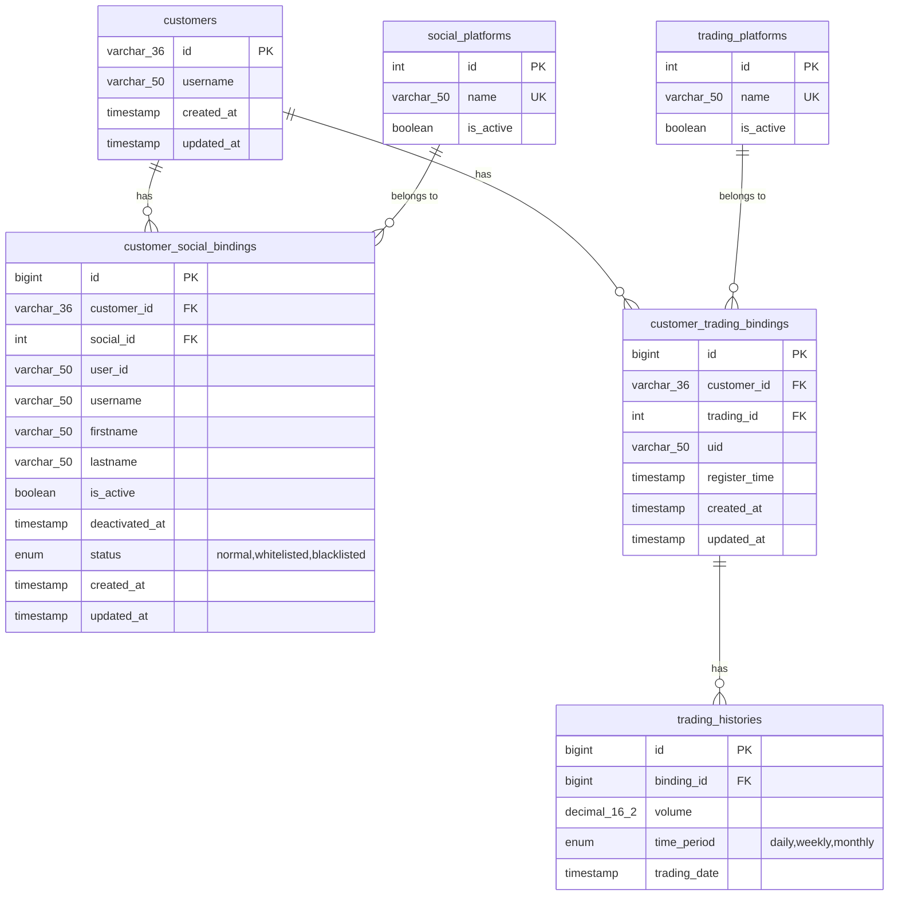

# omcc

### Api list:
```
/v{version}/admin/customer?uid=
/v{version}/admin/customers?page=&limit=
```

### DB structure:

```mermaid
erDiagram
    customers {
        varchar_36 id PK
        varchar_50 username
        timestamp created_at
        timestamp updated_at
    }

    social_platforms {
        int id PK
        varchar_50 name UK
        boolean is_active
    }

    trading_platforms {
        int id PK
        varchar_50 name UK
        boolean is_active
    }

    customer_social_bindings {
        bigint id PK
        varchar_36 customer_id FK
        int social_id FK
        varchar_50 user_id
        varchar_50 username
        varchar_50 firstname
        varchar_50 lastname
        boolean is_active
        timestamp deactivated_at
        enum status "normal,whitelisted,blacklisted"
        timestamp created_at
        timestamp updated_at
    }

    customer_trading_bindings {
        bigint id PK
        varchar_36 customer_id FK
        int trading_id FK
        varchar_50 uid
        timestamp register_time
        timestamp created_at
        timestamp updated_at
    }

    trading_histories {
        bigint id PK
        bigint binding_id FK
        decimal_16_2 volume
        enum time_period "daily,weekly,monthly"
        timestamp trading_date
    }

    customers ||--o{ customer_social_bindings : "has"
    customers ||--o{ customer_trading_bindings : "has"
    social_platforms ||--o{ customer_social_bindings : "belongs to"
    trading_platforms ||--o{ customer_trading_bindings : "belongs to"
    customer_trading_bindings ||--o{ trading_histories : "has"
```